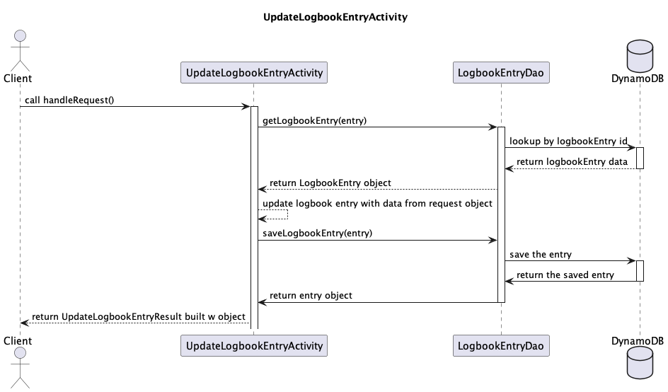

# Design Document

## _Redpoint_ Design

## 1. Problem Statement

Redpoint will allow users to leave the clunky climbing guidebooks at home and access all the information they need for a
day at the crag through their internet-connected device. Users will be able to view real-time weather forecasts for areas they plan to visit. Also, users will be able to add routes to their personal logbooks and add comments on routes.


## 2. Use Cases

1. As a user, I would like to search all climbing areas on the homepage of the app.
2. As a user, I'd like to be able to click into an area and see all crags in that area and the weather forecast in that area.
3. As a user, I'd like to be able to click into a crag and see all the routes in that crag.
4. As a user, I'd like to click on a route and see all its attributes (difficulty, description, protection, location, comments)
5. As a user, I'd like to be able to add a comment to a route.
6. As a user, I'd like to be able to delete a comment.
7. As a user, I'd like to be able to add a route to my logbook list (including notes on it like how many tries, redpoint/onsight, conditions, etc.)
8. I'd like to be able to go to my profile and see / edit my logbook.

## 4. Project Scope

### 4.1. In Scope

The app will offer a way for users to interact with the route data that comes from the OpenBeta API
it in an organized way.
Users will be able to create/delete comments on routes and update their own logbooks with climbs that already exist in the guidebook.

Users will be able to see a local weather forecast from the "Area" page

### 4.2. Out of Scope

Anything listed here will be a stretch goal. They include searching routes by particular attributes, filtering routes by
a particular rating, adding photos to route pages, adding a mapping feature that shows the location of each crag on the
map. Making comments that have particular expiration (3 days for "lost and found", 30 days for temporary information)

Currently, I don't anticipate allowing users to upload their own routes or areas and the app will only allow access to
pre-existing routes, crags, and areas.

# 5. Proposed Architecture Overview

We have a hierarchy of POJOs dictated by the structure of the data coming from the OpenBeta API -- Areas have either a list of Areas, or a list of Climbs. Climbs attributes have Comments. Every Comment is tied to the User who created it, and only that User can delete/update it. Each user also has Logbook.
Only they can edit their lists. There are activities to get all the areas, all the crags in an area, all the climbs in a
crag, and all the comments on a climb, as well as activities to get particular areas, particular crags, and particular
climbs.
There are activities to update a Logbook for a User
delete, and update comments and dates.

The front end will provide intuitive ways to interact with all of these features.

[Class Diagram is here](Redpoint.puml)

# 6. API

## 6.1. Public Models

`AreaModel`

```
String uuid;
String areaName;
List<Area> children;
List<Climb> climbs;
Content content;
Metadata metadata;
```

`ClimbModel`

```
String uuid;
String name;
String yds;
Content content;
Metadata metadata;
```

`LogbookEntryModel`

```
String date;
String userId;
String climbId;
String notes;
```

`CommentModel`

```
String userId;
String timestamp;
String climbId;
String text;
String commentId;
```

## 6.2. Endpoints

### GetAllAreas Endpoint

* Accepts `GET` requests to  `/areas/:query`

### GetArea Endpoint

* Accepts `GET` requests to  `areas/:areaId`
* If the area can't be found, throws `AreaNotFoundException`

### GetClimb Endpoint

* Accepts `GET` requests to  `climbs/:climbId`
* If the climb can't be found, throws `ClimbNotFoundException`

### GetAllCommentsForClimb Endpoint

* Accepts `GET` requests to `comments/:climbId`

### CreateComment Endpoint

* Accepts `POST` requests to `comments`
* Includes data such as the text of the comment, the climbId of the climb it's on, the userId of the commenter, and the
  numerical star rating of the commenter

### DeleteComment Endpoint

* Accepts `DELETE` requests to `comments/:commentId`
* If the comment can't be found, throws `CommentNotFoundException`


### CreateLogbookEntry Endpoint

* Accepts `POST` requests to  `entries/`

### UpdateLogbookEntry Endpoint

* Accepts `PUT` requests to `entries`
* 

### DeleteLogbookEntry Endpoint

* Accepts `DELETE` requests to `entries/{userId}`


# 7. Tables

_Define the DynamoDB tables you will need for the data your service will use. It may be helpful to first think of what
objects your service will need, then translate that to a table structure, like with the *`Playlist` POJO* versus
the `playlists` table in the Unit 3 project._

### 7.1.

`CommentTable`

```
@DynamoDBHashKey String commentId;
@DynamoDBRangeKey String climbId;
String userId;
String text;
String date;

GSI: @HashKey climbId
    include ALL
```
`AscentsTable`

```
@DynamoDBHashKey String userId;
@DynamoDBRangeKey String climbId;
String notes;
String date;

```

# 8. Pages

