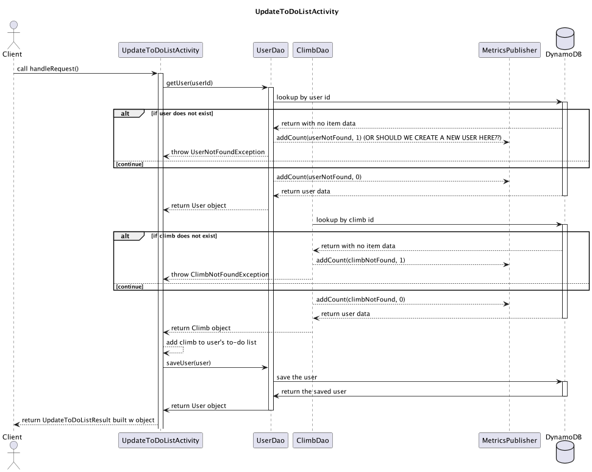
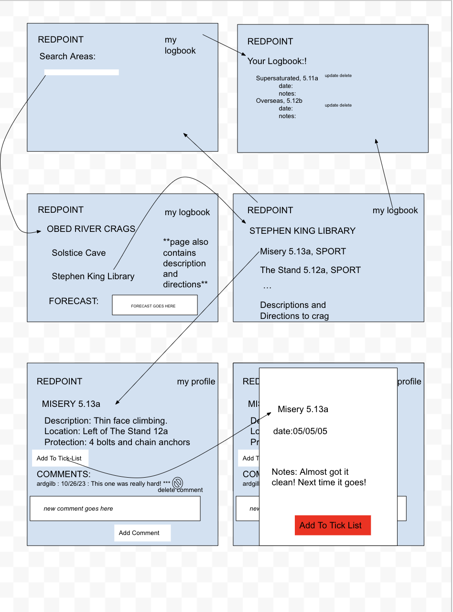

# Design Document

## _Redpoint_ Design

## 1. Problem Statement

Redpoint will allow users to leave the clunky climbing guidebooks at home and access all the information they need for a
day at the crag through their internet-connected device. Additionally, users will be able to add routes to their
tick-lists and
to-do-lists, comments on routes, upload photos of routes, and search routes based on a variety of attributes.

Questions:
* When do users get created? The first time they comment/add a climb to one of their lists? Or the first time they log
into the app? Probably the latter.
* How can I make it so I can view climbs for a particular crag in a left -> right order? 
* Does the weather API call happen from the front end? I believe so.


## 2. Use Cases

1. As a user, I would like to see a list of all the climbing areas on the homepage of the app.
2. As a user, I'd like to be able to click into an area and see all crags in that area and the weather forecast in that area.
3. As a user, I'd like to be able to click into a crag and see all the routes in that crag.
4. As a user, I'd like to click on a route and see all its attributes (difficulty, description, protection, location, comments)
5. As a user, I'd like to be able to add a comment to a route (extension: make comments that expire in 7 days, 30 days, or never)
6. As a user, I'd like to be able to update a comment.
7. As a user, I'd like to be able to add a route to my to-do list
8. As a user, I'd like to be able to add a route to my tick list (including notes on it like how many tries, redpoint/onsight,
   conditions, etc.)
9. I'd like to be able to go to my profile and see / edit my to-do / tick lists and comments.
10. I'd like to be able to go to another climbers profile and see their to-do/tick lists and comments.

## 4. Project Scope

### 4.1. In Scope

The app will offer a way for users to interact with the route data that has been loaded in by the developers and present
it in an organized way.
Users will be able to create/delete comments on routes and update their own to-do lists and tick lists with climbs that already exist in the guidebook.

Users will be able to see a local weather forecast from the "Area" page

### 4.2. Out of Scope

Anything listed here will be a stretch goal. They include searching routes by particular attributes, filtering routes by
a particular rating, adding photos to route pages, adding a mapping feature that shows the location of each crag on the
map. Making comments that have particular expiration (3 days for "lost and found", 30 days for temporary information)

Currently, I don't anticipate allowing users to upload their own routes or areas and the app will only allow access to
pre-existing routes, crags, and areas.

# 5. Proposed Architecture Overview

We have a hierarchy of POJOs -- Areas have Crags, Crags have Climbs, Climbs have Comments. Every Comment is tied to the
User who created it, and only that User can delete/update it. Users have lists of climbs that they have collected.
Only they can edit their lists. There are activities to get all the areas, all the crags in an area, all the climbs in a
crag, and all the comments on a climb, as well as activities to get particular areas, particular crags, and particular
climbs.
There are activities to update a User (through updating their to-do or tick lists), as well as activites to create,
delete, and update comments.

The front end will provide intuitive ways to interact with all of these features.

[Class Diagram is here](Redpoint.puml)

# 6. API

## 6.1. Public Models

`AreaModel`

```
String areaId;
String name;
double[] location;
String description;
String directions;
String weather;
List<String> crags;
```

`CragModel`

```
String areaId;
String cragId;
String name;
String directions;
String description; 
List<String> climbs;
```

`ClimbModel`

```
String cragId;
String climbId;
String name;
Double stars;
String location;
String Description;
String rating;
String style;
String protection;
List<String> comments;
```

`UserModel`

```
String userId;
List<Climb> toDoList;
List<CompletedClimb> tickList;
```

`CommentModel`

```
String userId;
ZonedDateTime time;
String climbId;
String text;
Double stars;
```

## 6.2. Endpoints

### GetAllAreas Endpoint

* Accepts `GET` requests to  `/areas`

### GetArea Endpoint

* Accepts `GET` requests to  `areas/:areaId`
* If the area can't be found, throws `AreaNotFoundException`

### GetAllCragsInArea Endpoint

* Accepts `GET` requests to  `crags/:areaId`

### GetCrag Endpoint

* Accepts `GET` requests to `crags/:cragId`
* If the crag can't be found, throws `CragNotFoundException`

### GetAllClimbsInCrag Endpoint

* Accepts `GET` requests to  `climbs/:cragId`

### GetClimb Endpoint

* Accepts `GET` requests to  `climbs/:climbId`
* If the climb can't be found, throws `ClimbNotFoundException`

### GetAllCommentsForClimb Endpoint

* Accepts `GET` requests to `comments/:climbId`

### CreateComment Endpoint

* Accepts `POST` requests to `comments`
* Includes data such as the text of the comment, the climbId of the climb it's on, the userId of the commenter, and the
  numerical star rating of the commenter

### DeleteComment Endpoint

* Accepts `DELETE` requests to `comments/:commentId`
* If the comment can't be found, throws `CommentNotFoundException`

### UpdateComment Endpoint

* Accepts `PUT` requests to `comments/:commentId`
* If the comment can't be found, throws `CommentNotFoundException`

### GetUser Endpoint

* Accepts `GET` requests to  `users/:userId`
* If the user can't be found, throws `UserNotFoundException`

### UpdateUserTickList Endpoint

* Accepts `PUT` requests to `users/:userId/:climbId`
* Includes the data to update the Climb to a CompletedClimb
* If the user or climb can't be found, throws the appropriate exception.

### UpdateUserToDoList Endpoint

* Accepts `PUT` requests to `users/:userId/:climbId`
* If the user or climb can't be found, throws the appropriate exception.


# 7. Tables

_Define the DynamoDB tables you will need for the data your service will use. It may be helpful to first think of what
objects your service will need, then translate that to a table structure, like with the *`Playlist` POJO* versus
the `playlists` table in the Unit 3 project._

### 7.1.

`AreaTable`

```
@DynamoDBHashKey String areaId;
String name;
Number Set coordinates
String description;
String directions;
String weather;
String Set crags;
```

`CragTable`

```
@DynamoDBHashKey String areaId;
@DynamoDBRangeKey String cragId;
String name;
String directions;
String description; 
String Set climbs;
```

`'ClimbTable`

```
@DynamoDBHashKey String cragId;
@DynamoDBRangeKey String climbId;
String name;
Number stars;
Number numRatings;
String location;
String Description;
String rating;
String protection;
String Set comments;

GSI: @HashKey climbId 
    include ALL
```

`UserTable`

```
@DynamoDBHashKey String userId;
String Set toDoList;
String Set tickList;
```

`CommentTable`

```
@DynamoDBHashKey String userId;
@DynamoDBRangeKey String time;
String climbId;
String text;
Number stars;

GSI: @HashKey climbId
    include ALL
```

# 8. Pages

